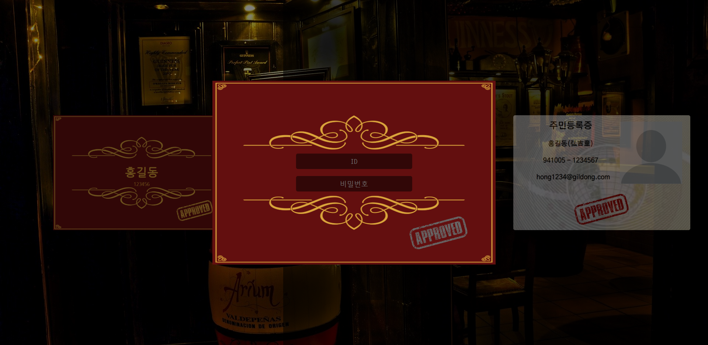

# 술이 그대를 구원하리라

간단한 정보를 입력한 뒤 회원가입을 하면 고민을 털어놓고 다른 회원에게 조언을 구할 수 있고 다른 사람의 고민을 해결해주는 롤링페이퍼 형식의 서비스

술집에서 주문한 술을 남기면 보관해둔 뒤 다음에 다시 찾아와 마시는 것처럼 마찬가지로 고민을 보관해두고 다시 찾아왔을 때 다른 많은 사람들이 고민을 해결해 줄 수 있도록 댓글을 남기는 형식으로 진행

## 사용기술

- React.js
- React Router
- Sass
- Node.js Express
- MongoDB
- AWS ec2

## 스크린샷

- intro
  
  네온사인이 몇 차례 깜빡이는 애니메이션이 끝나면 hover와 click 이벤트 활성

- check
  
  왼쪽 상자 선택으로 로그인 
  오른쪽 상자 선택으로 회원가입 
  각 컴포넌트는 모달 상자 바깥을 누르면 꺼짐

- login
  
  알맞은 아이디와 비밀번호를 입력하면 입장

- join
  
  알맞은 아이디와 비밀번호 및 이메일을 적어서 DB에 회원정보 추가 후 입장

- main
  
  왼쪽 상단의 비상구로 로그아웃 가능 
  바텐더에게 말을 걸어 다른사람의 고민 해결 
  메뉴를 선택해 고민 작성 
  각 컴포넌트는 모달 상자 바깥을 누르면 꺼짐

- talk
  
  위의 공간에 다른 사람들의 고민이 나타남 
  아래 폼에 댓글 작성후 상담 완료 버튼을 클릭하면 댓글 저장 
  오른쪽 하단의 다른 대화 버튼을 클릭하면 다른 글로 변경

- menu
  
  왼쪽 오른쪽 화살표로 술 종류 선택 가능 
  작성한 고민이 없을 때는 이미지만 나타나도 글 새로쓰기 이벤트 연결 
  작성한 고민이 있을 때는 이미지와 글이 나타나고 댓글 선택 이벤트 연결 
  왼쪽 하단의 글 수정 버튼을 이용해 글 수정 
  오른쪽 하단의 글 삭제 버튼을 이용해 글 삭제

- write
  
  고민의 제목과 내용을 입력한 뒤 keep버튼을 눌러 글 저장

- glass
  
  다른 사람들이 남긴 댓글 표시 
  이미 읽은 댓글은 흐릿하게, 새로운 댓글은 선명하게 표시 
  아래쪽으로 스크롤 할 때마다 새로운 댓글 업데이트

- reply
  
  다른 사람이 남긴 댓글을 나타내고 상단의 화살표 버튼을 눌러 원래 고민을 읽을 수 있음 
  왼쪽과 오른쪽의 댓글 이동 버튼을 이용해 다른 댓글로 이동 가능 
  댓글 삭제 버튼을 이용해 댓글 삭제 가능
